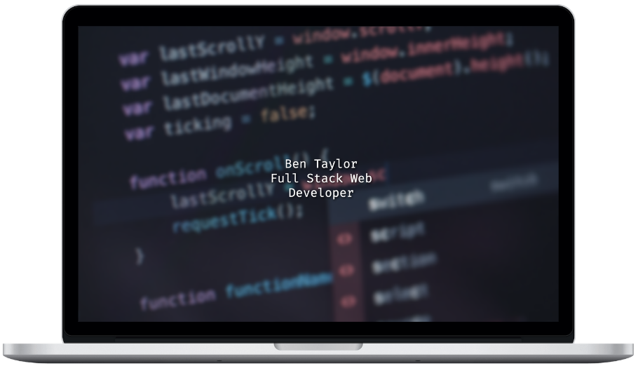

# Portfolio

This site was created using Gatsby and Styled Components. This site can be found at [https://bt-portfolio.netlify.app](https://bt-portfolio.netlify.app).



## Getting Started

These instructions will get you a copy of the project up and running on your local machine.

Ensure Node.js and npm are installed before proceeding.

First, change to the destination directory then run the following command in your terminal:

```bash
git clone https://github.com/tben140/Portfolio.git
```

Next, cd into the project directory and install the project dependencies with the following commands:

```bash
cd Portfolio
npm install
```

To start the server locally, run the following command, then go to [http://localhost:8000](http://localhost:8000):

```bash
gatsby develop
```
